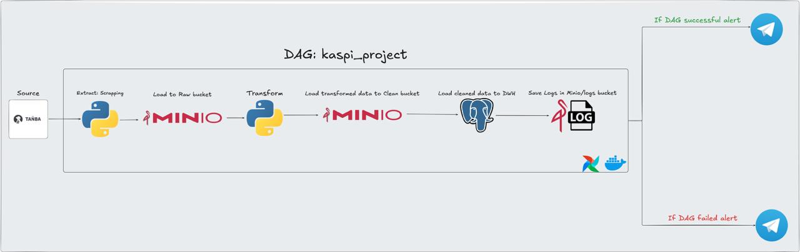
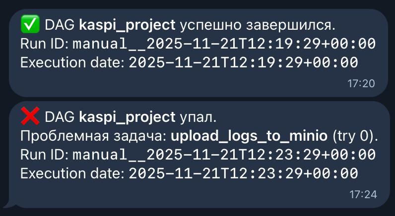

# ETL-проект по данным tanba.kezekte.kz



В рамках проекта реализован полноценный ETL-конвейер по работе с данными о зарегистрированных животных.  
Основной источник данных — открытая платформа **[tanba.kezekte.kz](https://tanba.kezekte.kz)**, откуда с помощью скриптов на **Python** выполняется веб-скрапинг и первичная очистка данных.

## Структура проекта

```bash
project/
├── config/
│   └── airflow.cfg          # Конфигурация Airflow
├── dags/
│   └── kezekte_etl.py       # Основной DAG: скрапинг → трансформация → загрузка в DWH
├── datas/                   # Данные/выгрузки (при необходимости)
├── img/
│   ├── kaspi_project.jpeg   # Картинка/баннер проекта для README/презентаций
│   └── telega_alert.jpeg    # Скриншот Telegram-уведомления
├── logs/                    # Логи выполнения (могут мапиться на том Docker’а)
├── plugins/                 # Плагины Airflow (если используются)
├── venv/                    # Локальное виртуальное окружение Python
├── .env                     # Переменные окружения (Postgres, MinIO, Telegram и т.д.)
├── .gitignore               # Исключения для Git
├── docker-compose.yaml      # Поднятие Airflow, Postgres, MinIO и др. сервисов
├── Dockerfile               # Docker-образ для Airflow/ETL
├── README.md                # Документация проекта
└── requirements.txt         # Зависимости Python
```

## Архитектура и процесс ETL

1. **Extract (извлечение)**
   - Скрапинг открытых данных с сайта `tanba.kezekte.kz`.
   - Выбор только актуальных записей за целевую дату.
   - Сохранение сырых данных (формат CSV) в объектное хранилище **MinIO** в слой `raw`.

2. **Transform (преобразование)**
   - Очистка и нормализация полей (имена, пол, даты, статусы и т.д.).
   - Формирование структурированных записей для загрузки в хранилище данных.
   - Сохранение очищенных данных в MinIO в слой `clean`.

3. **Load (загрузка)**
   - Загрузка данных из слоя `clean` в хранилище на **PostgreSQL**.
   - Структура хранилища:
     - измерения: `animal_dimension`, `region_dimension`, `unit_dimension`;
     - факт-таблица: `animal_facts` (регистрации животных и связанные атрибуты).

## Оркестрация и мониторинг

- Все этапы ETL (скрапинг → трансформация → загрузка в DWH → выгрузка логов) оркестрируются с помощью **Apache Airflow**.
- Настроено расширенное **логирование**:
  - логи задач пишутся в отдельный лог-файл;
  - лог-файл дополнительно сохраняется в бакет **MinIO** `logs`.
- Реализованы **Telegram-уведомления**:
  - оповещение об успешном завершении DAG;
  - оповещение о падении DAG с указанием задачи и run_id.

## Начало работы

#### Установка и активация виртуальной среды
Перед запуском проекта рекомендуется создать и активировать виртуальную среду (venv), чтобы изолировать зависимости проекта:

##### **Создание виртуальной среды**:
```
python3 -m venv venv
```

##### Активация виртуальной среды::
- Windows:
    ```
    .\venv\Scripts\activate
    ```
- macOS/Linux:
    ```
    source venv/bin/activate
    ```
После активации виртуальной среды в нее будут установлены все зависимости.
#### Создание образов Docker
Чтобы создать образы Docker, перейдите в корневой каталог проекта в вашем терминале и запустите следующую команду в фоновом режиме:

```
docker-compose up -d
```
Чтобы показать все запущенные контейнеры docker
```
docker ps
```
Чтобы остановить все контейнеры docker
```
docker-compose down
```
Чтобы зайти внутрь контейнера docker
```
docker exec -it <containerID> bash
```
-----

## Предпосылки
- Docker: Убедитесь, что в вашей системе установлен Docker. Вы можете скачать его [здесь](https://www.docker.com/products/docker-desktop).
- Docker Compose: Также убедитесь, что установлен Docker Compose. Вы можете найти его [здесь](https://docs.docker.com/compose/install/).

## Сервисы

| Service     | Port                    | User        | Password
| ----------- | -----------             | ----------- | -----------
| Airflow     | http://localhost:8080   | airflow     | airflow
| PostgreSQL  | Dbeaver host:localhost  | etl_user    | etl_pass
| minIO       | http://localhost:9001   | admin       | adminpass

## Соединение с Postgres

Это самый важный шаг для работы ETL. Вам нужно сообщить Airflow, как подключиться к базе данных `postgres-etl-target`.

1. В пользовательском интерфейсе Airflow перейдите в **Admin → Подключения**
2. Нажмите кнопку **+**, чтобы добавить новое подключение
3. Заполните форму, указав точные значения:

   | Field | Value | Notes |
   |-------|-------|-------|
   | **Connection Id** | `dwh_postgres_conn` | Это должно соответствовать `ETL_POSTGRES_CONN_ID` в файле DAG |
   | **Connection Type** | `Postgres` | |
   | **Host** | `postgres-etl-target` | Это название сервиса из `docker-compose.yml` |
   | **Schema** | `etl_db` | Из переменных среды `postgres-etl-target` |
   | **Login** | `etl_user` | Из переменных среды `postgres-etl-target` |
   | **Password** | `etl_pass` | Из переменных среды `postgres-etl-target` |
   | **Port** | `5432` | Это порт внутри сети Docker, а не порт хоста 5433 |

4. Нажмите **Проверить**. Должно появиться сообщение "Подключение успешно протестировано".
5. Нажмите **Save**.

## Telegram-уведомления (Alerting)

В проекте настроены Telegram-уведомления о статусе выполнения DAG в Apache Airflow.  
Уведомления отправляются при:

- ✅ успешном завершении DAG;
- ❌ падении DAG (с указанием проблемной задачи, номера попытки и `run_id`).

Пример уведомления:



---

### 1. Что именно отправляется в Telegram

Для каждого запуска DAG в Telegram приходит сообщение с информацией:

- `dag_id` — идентификатор DAG;
- `run_id` — идентификатор конкретного запуска;
- `logical_date` (execution date) — логическая дата запуска;
- при ошибке также указываются:
  - `task_id` — задача, на которой упал DAG;
  - `try_number` — номер попытки выполнения.

Сообщения форматируются в HTML и отправляются через Telegram Bot API.

---

### 2. Переменные окружения

Для работы алертов используются две переменные окружения (хранятся в `.env`):

```env
TELEGRAM_BOT_TOKEN=ваш_токен_от_BotFather
TELEGRAM_CHAT_ID=ваш_chat_id
```

## Источник
В качестве источников данных используются открытые данные с платформы [**tanba.kezekte.kz**](https://tanba.kezekte.kz/ru/frameless/animal/list?p=1).
